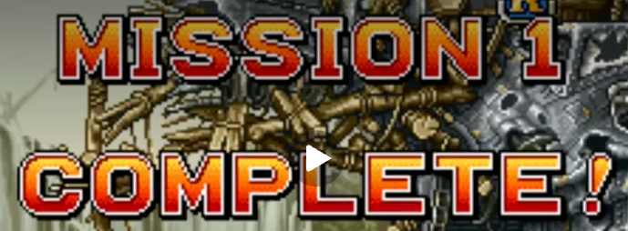
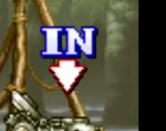
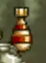
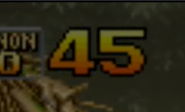
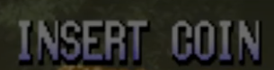
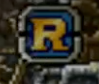
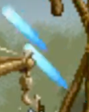
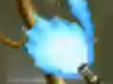

# REFERENCIAS ARCADE — el lenguaje visual de las letras y la UI *(23/9/2026)*

> **Qué es.** Ocho recortes que el autor pasó como referencia de un arcade de los noventa (el
> género run-and-gun de pixel art). **No se usan en el juego**: son la vara para las letras
> grandes, los marcadores y los íconos. Las imágenes están en `referencias_arcade/`.
>
> **Regla:** se toma el LENGUAJE (degradé, contorno grueso, píxel gordo, color de señal), nunca el
> dibujo. Nada de estas imágenes se copia a `assets/`.

---

## Lo que ya se aplicó

| referencia | qué se tomó | dónde vive |
|---|---|---|
|  **MISSION 1 COMPLETE!** | letras gordas con degradé **amarillo → naranja → rojo**, contorno casi negro con un filo rojo oscuro, píxel grande | estilo `fuego` de `src/render/rotulo.js`. Hoy pinta **la flecha que marca el blanco** (los colores se invirtieron el 23/9) |
|  **IN ▼** | letras **blanco → azul** con contorno azul noche, y la **flecha roja con centro blanco** que late apuntando abajo | estilo `hielo`: **el rótulo RASANTE que pasa volando** cada vez que el poder cambia la cámara (entra por la derecha, 1 s quieto en el centro, sale por la izquierda). La **flecha** de la referencia es `flechaIn()`: sobre el buque de LA SUELTA cuando está cerca, **sin palabra** y en colores fuego |
|  **la bomba** | cuerpo **crema**, **bandas rojas**, cola **dorada**: una bomba que se lee de un vistazo por el color, no solo por la silueta | el ícono `bomba` de `src/data/iconos.js` (el estante del HUD), que ganó **paleta propia** (`pal`). Apagada o en señal (verde de SOLTÁ, gris bloqueada) se pinta de un color con `mono` |

## Lo que queda de referencia *(sin aplicar todavía)*

| referencia | qué dice | dónde podría ir |
|---|---|---|
|  **45** | números con el mismo degradé `fuego`, cursiva, contorno oscuro; al lado, un rótulo chico apagado | el **puntaje** y el **multiplicador** del rasante (x10 → x30). El motor ya existe: `letras(txt, 'fuego', tam, …)` |
|  **INSERT COIN** | letra de píxel **gris lavanda**, sin degradé, con sombra dura: texto de sistema que titila | los carteles que esperan una tecla (**"APRETÁ PARA SEGUIR"**, la portada, la pausa) |
|  **R** | insignia cuadrada: letra dorada sobre placa azul con bisel | ícono de **poder** en el tablero: la **R** del RASANTE, la M del MOMENTUM, la C de la Chancha — una insignia por poder en vez de una letra suelta |
|  **el tiro con estela** | proyectil con **estela celeste** larga que se afina hacia atrás | las **trazadoras** del cañón (`render/ammo.js`): hoy son naranja; una estela más larga y afinada se leería mejor a velocidad |
|  **el fogonazo azul** | destello de boca **azul-blanco**, redondo y corto | el **fogonazo del cañón** o el **impacto** en chapa enemiga; también candidato para la luz del poder RASANTE |

---

## El motor de letras *(para usarlo en lo que sigue)*

```js
import { letras, drawRotuloVuelo, flechaIn } from './render/rotulo.js';
letras('x30', 'fuego', 18, x, y);        // un rótulo quieto, centrado en (x, y), coords de mundo
drawRotuloVuelo('RASANTE', t);           // el que pasa volando; t = segundos desde que arrancó
flechaIn(x, puntaY, 2);                  // la flecha del IN en colores fuego, apuntando a (x, puntaY); 2 = pixel doble
```

- Se hornea **una vez** por palabra, estilo y tamaño, a resolución de **mundo** (480×270), y se
  pinta sin suavizado: el buffer 2× lo agranda en píxeles gordos.
- La tipografía es **OtflagSans en negrita** (`menuFont`): la del logo, Kirana, es light y se leía
  fina. Mientras no cargó sale el monospace de respaldo, y cuando carga el rótulo se re-hornea solo.
- Agregar un estilo nuevo es sumar una entrada a `ESTILOS` (degradé + contorno + filo).
